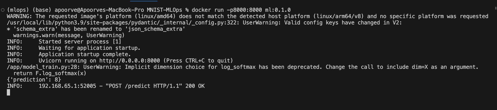

<h1>
Developing a MLOPS Pipeline for MNIST dataset
</h1>

**Author:**  Apoorve Kalot

# Basic Info:

* Model files and dataset are not included inside the repo, to get it, first install requirements needed using `pip install -r requirements.txt` and run model_train.py
* Once model is prepared,

    * You can run model_inference.py for model inference which is FastAPI based server.

    * Or you can make dockerimage using following dockerfile by running the command ` docker build --platform linux/amd64 -t ml:0.1.0 .`

    * Now you can either start a local container using following command `docker run -p8000:8000 ml:0.1.0`

    

    * Or push the docker image in container registry, which to be fetch for kubernetes deployment, needed yaml file is here with name 'mnist_deployment_service.yaml'

* You can use client code in your own functions to do inference or you can use postman in following way.

* There is additional code in repo:
    * utils.py: For generating random image for inference as part of testing.
    * stressTesting.py: Average time taken for sequential and concurrent request testing for model inference.
    * mlflow: folder containing mlflow deployment dependencies in kubernetes

# Note:
* For the factor of providing low latency:
    * Even though model is small, so latency won't be an issue here, but incase of different use-case, *Future works* involves usage of torch.JIT framework or cpu/gpu accelerator frameworks (openVINO/TensorRT).
* For the factor of providing low docker size:
    * The least possible cpu inference suporting torch and torchvision dependencies makes the docker image as *1.3 GB*.
    * Using the Triton Inference Server in this case will be overkill as lowest supported triton image will be of size *4+GB*.
* Regarding usage of MLFlow:
    * Not able do debug issue in mlflow deployment file (for testing in minikube) in stipulated time `Future Works`.
* Using Prometheus-Grafana-Loki Stack:
    * Since Logging explicitly hasn't been included, the easiest usage of this stack can be by installing these directly into cluster using Helm-Charts.
* For More control over visiblity of all the process, users can include a Prometheus Pushgateway Binary which can push custom metrics into prometheus TSDB if needed (but is optional as it is overkill; explained in architecture diagram)

# Architecture

* Basic Architecture:

* Prod Level Architecture:

